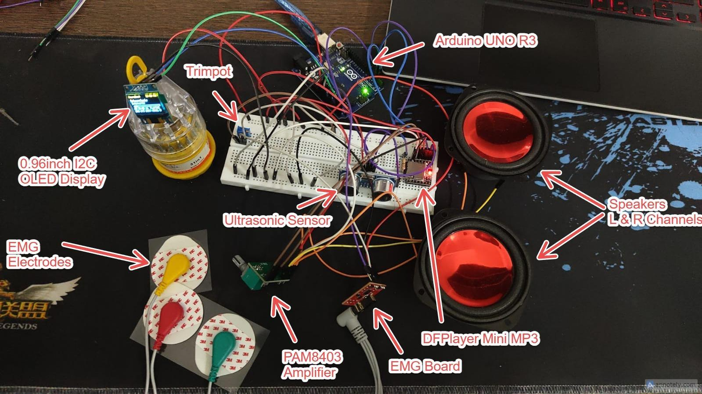
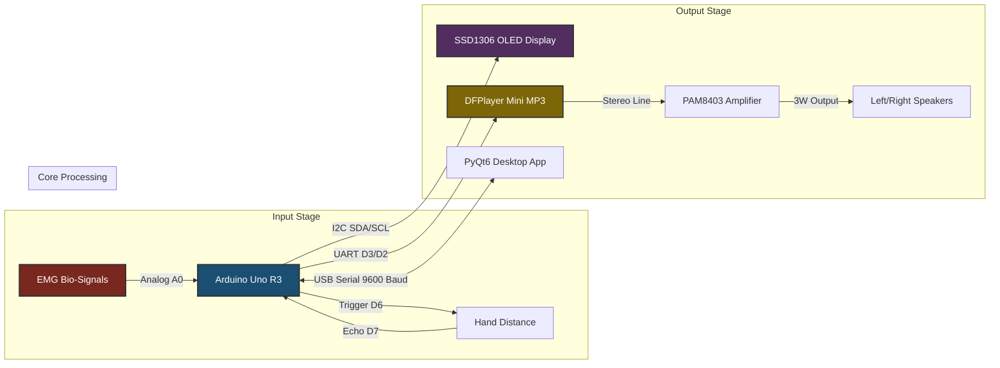
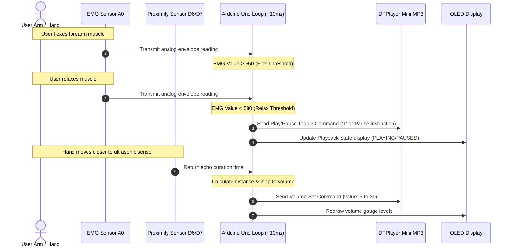

<h1 align="center">EMG Controlled Music System Using Arduino</h1>
<p align="center">
  <strong>An interactive bio-signal and gesture-controlled audio system powered by Electromyography (EMG) and Ultrasonic proximity sensing.</strong>
</p>

<p align="center">
  
  
</p>

<p align="center">
  <a href="#project-overview">Project Overview</a> •
  <a href="#system-architecture">System Architecture</a> •
  <a href="#documentation-map">Documentation Map</a> •
  <a href="#results--performance">Results</a> •
  <a href="https://github.com/rudy-07/EMG-Music-Controller/issues">Report Bug</a>
</p>

---

## Project Overview

Traditional consumer audio interfaces rely heavily on touchscreens, physical buttons, or voice assistants. While suitable for standard scenarios, these interfaces fail in accessibility-first situations (e.g., motor neuron disorders, severe arthritis) and hands-occupied environments (e.g., medical surgery, laboratories, industrial work, cooking).

The EMG Controlled Music System resolves these challenges by introducing a hands-free, low-latency, and ambient noise-robust audio control interface. The system harnesses two primary inputs:
1. **Electromyography (EMG) Bio-signals**: Captures electrical depolarization impulses from forearm muscle contractions using surface electrodes to toggle play/pause states.
2. **Ultrasonic Proximity Sensing**: Measures spatial hand distance (5–40 cm) to dynamically adjust audio volume, offering a fluid and touchless analog volume deck.

The hardware is managed by an Arduino Uno R3 acting as a real-time cyclic controller. The system features local OLED UI diagnostics, amplified stereo speakers, and syncs over a two-way USB serial interface with a companion PyQt6 Desktop Monitoring Dashboard.

---

## Features

* **Real-Time EMG Acquisition**: 10-bit analog bio-signal extraction with low-pass/high-pass filtered signal envelopes.
* **Hysteresis-Based Classification**: Dual-threshold state machine (650 flex / 580 relax) to eliminate transient noise triggers.
* **Debounce & Cooldown Protection**: A non-blocking 5-second cooldown timer prevents accidental double-triggers.
* **Ultrasonic Volume Mapping**: Fluid gesture volume adjustments (5 cm to max volume, 40 cm to min volume) with non-blocking timeouts.
* **PyQt6 Desktop Dashboard**: Scrolling live EMG graph plotter, custom widgets (radial gauges, sliding toggles), and an interactive manual signal simulator.
* **On-Device OLED Display**: Local 128x64 display rendering current song metadata, progress bar seekbar, clock, volume, and raw EMG levels.
* **Amplified Audio Subsystem**: FAT32 microSD audio decoding via DFPlayer Mini, amplified by a PAM8403 Class-D chip driving dual 3W stereo speakers.
* **Software-Based Playback Tracker**: Non-blocking algorithm calculating elapsed seconds to manage auto-progression and looping.

---

## Screenshots

### 1. PyQt6 Companion Dashboard (Simulation Mode)
The interactive dashboard provides real-time signal visualizations, gauges, and manual debugging options.
<p align="center">
  
</p>

### 2. Physical Prototype Hardware Layout
The complete breadboard assembly containing the Arduino Uno, sensors, audio components, and display.
<p align="center">
  
</p>

---

## System Architecture

The hardware and software layers integrate in a closed-loop data pipeline:



### Signal Verification Workflow



---

## Folder Structure

```text
/
├── README.md                  # Project landing page & documentation map
├── LICENSE                    # MIT License
├── CONTRIBUTING.md            # Guidelines for open-source contributions
├── CODE_OF_CONDUCT.md         # Behavioral guidelines
├── CHANGELOG.md               # Version update history
├── CITATION.cff               # Citation file for academic referencing
├── requirements.txt           # Python library requirements
├── environment.yml            # Conda environment definition
├── app.py                     # PyQt6 companion desktop app source code
├── arduino code.txt           # Arduino Uno firmware code
├── docs/                      # Technical documentation
│   ├── overview.md            # Bio-signal theory and application fields
│   ├── architecture.md        # Hardware schematics and wiring pinout tables
│   ├── preprocessing.md       # Analog filtering and 10-bit ADC conversion math
│   ├── training.md            # Hysteresis state machine & non-blocking debounce
│   ├── inference.md           # Firmware loop timings and non-blocking I/O
│   ├── evaluation.md          # Quantitative testing benchmarks & latencies
│   ├── datasets.md            # Serial communication API & data formats
│   ├── results.md             # Modality comparison, limitations, and future plan
│   ├── api.md                 # Firmware functions & Python class listings
│   ├── faq.md                 # Frequently Asked Questions
│   └── troubleshooting.md     # Debugging trees for sensors, serial, and audio
└── assets/
    └── images/                # Extracted figures and GUI screenshots
```

---

## Quick Start

### Hardware Requirements
- Arduino Uno R3 (or compatible microcontroller)
- Surface EMG Sensor Module (e.g., MyoWare, Gravity EMG)
- HC-SR04 Ultrasonic Sensor
- DFPlayer Mini MP3 Player Module + microSD Card
- PAM8403 Class-D Audio Amplifier + 2x 3W Speakers
- SSD1306 I2C OLED Display (128x64)
- 1kΩ Resistor, 10kΩ calibration trimpot, and breadboard cables

### Firmware Installation
1. Open the [arduino code.txt](arduino%20code.txt) file and copy it into a new sketch in the **Arduino IDE**.
2. Install the following libraries via the Library Manager (`Ctrl+Shift+I`):
   - `Adafruit SSD1306`
   - `Adafruit GFX Library`
   - `DFRobotDFPlayerMini`
3. Connect the hardware using the pin mapping guide in the [Wiring Reference](docs/architecture.md).
4. Upload the code to your Arduino Uno.

### Companion App Execution
1. Ensure Python 3.10+ is installed on your computer.
2. Clone the repository and install requirements:
   ```bash
   pip install -r requirements.txt
   ```
3. Run the desktop application:
   ```bash
   python app.py
   ```
   *Note: If no physical hardware is connected, the app automatically runs in **Simulation Mode** (with simulated waveforms).*

---

## Results & Performance

HIL testing of the non-blocking firmware verified the following benchmarks:

| Performance Metric | Design Target | Observed Benchmark | Status |
| :--- | :---: | :---: | :---: |
| **Main Program Loop Execution** | $< 50\text{ ms}$ / cycle | **$\approx 10\text{ ms}$** | **Exceeded (5x Headroom)** |
| **EMG Response Latency** | $< 200\text{ ms}$ | **$50\text{-}80\text{ ms}$** | **Met (Real-Time)** |
| **Volume Adjustment Latency** | $< 100\text{ ms}$ | **$20\text{-}30\text{ ms}$** | **Met (Real-Time)** |
| **False Trigger Rate** | $0$ / min | **$0$** | **Met (Debounced)** |

For a complete performance comparison against mechanical touch, voice, and brain-computer interfaces (BCIs), see [Results & Modality Comparisons](docs/results.md).

---

## Documentation Map

Navigate directly to individual technical documentation sections:

### Hardware & Preprocessing
* **[Wiring & Connections](docs/architecture.md)**: Physical assembly, pin layouts, and common ground setup.
* **[Signal Preprocessing](docs/preprocessing.md)**: Differential electrode positioning, analog filters, and 10-bit ADC math.

### Control Logic & Execution
* **[Hysteresis & State Machine](docs/training.md)**: Hysteresis calibration thresholds and non-blocking debounce cooldown.
* **[Real-Time Inference Timing](docs/inference.md)**: Non-blocking firmware loops and software song trackers.
* **[Evaluation Benchmarks](docs/evaluation.md)**: Execution latencies, responsiveness target metrics, and HIL test benchmarks.

### Interfaces & Troubleshooting
* **[Serial Commands & Simulator](docs/datasets.md)**: Standard serial packet format and interactive GUI waveforms.
* **[Codebase API Guide](docs/api.md)**: Class definitions, properties, and function signatures.
* **[FAQ Support](docs/faq.md)**: Sensor selection, custom song imports, and general questions.
* **[Diagnostic Manual](docs/troubleshooting.md)**: Troubleshooting flowcharts for serial, audio, display, and sensors.
* **[Performance Discussions](docs/results.md)**: Comparative modality reviews, hardware limitations, and future improvements.

---

## References

1. Reaz, M. B. I., Hussain, M. S., & Mohd-Yasin, F. (2006). *Techniques of EMG signal analysis: Detection, processing, classification and applications.* Biological Procedures Online, 8(1), 11–35. https://doi.org/10.1251/bpo115
2. De Luca, C. J. (2002). *Surface electromyography: Detection and recording.* Delsys Incorporated, 10, 2011.
3. Merletti, R., & Parker, P. (Eds.). (2004). *Electromyography: Physiology, engineering, and non-invasive applications.* Wiley-IEEE Press. https://doi.org/10.1002/0471678384
4. Phinyomark, A., Limsakul, C., & Phukpattaranont, P. (2012). *A novel feature extraction for robust EMG pattern recognition.* Journal of Computing, 1(1), 71–80.
5. Liu, W. (2025). *Using Arduino Uno and EMG electrodes for electromyographic signal measurement and servo control.* Theoretical and Natural Science, 98, 1–8. https://doi.org/10.54254/2753-8818/2025.21666
6. Arduino. (2023). *Arduino UNO Rev3 documentation and technical reference.* Retrieved April 1, 2026, from https://www.arduino.cc/en/Main/ArduinoBoardUno
7. Advancer Technologies. (n.d.). *Muscle sensor v3 user manual: Bio-signal hardware guidelines and application notes.* Advancer Technologies LLC.
8. DFRobot. (2018). *DFPlayer Mini MP3 player for Arduino — Product wiki and datasheet.* Retrieved April 1, 2026, from https://wiki.dfrobot.com/DFPlayer_Mini_SKU_DFR0299
9. Allegro MicroSystems. (2019). *PAM8403 — 3W stereo class-D audio amplifier datasheet.* Diodes Incorporated.
10. Solomon Systech Limited. (2008). *SSD1306 advance information: 128×64 dot matrix OLED/PLED segment/common driver with controller.* Solomon Systech Limited.

### Project Report
* **Primary Document**: [Project Report PDF](https://drive.google.com/file/d/1A77OALRSmsDKqUz_fCG38eqrIBeCx_OX/view?usp=drive_link)

---

## License

This project is licensed under the MIT License - see the [LICENSE](LICENSE) file for details.
