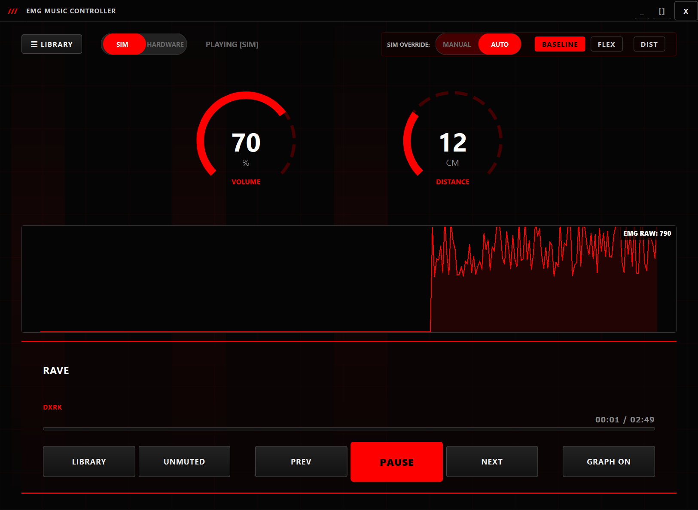

# Experimental Results & Discussion

This document details the observed behavior during testing, compares the system with traditional alternatives, and analyzes current limitations and pathways for future development.

---

## 1. Observed System Behavior

### EMG Play/Pause Control
Following calibration of the analog trimpot, forearm contractions consistently triggered play/pause toggles. The state transitions occur instantly on the OLED display and PC application interface upon muscle relaxation. The $5\text{-second}$ cooldown timer was verified to successfully block accidental double-triggers from prolonged contraction phases.

### Proximity Volume Control
The hand distance tracking operates smoothly within the $5\text{ cm}$ to $40\text{ cm}$ range. 
- Distances **$< 5\text{ cm}$** trigger a volume cap of $30$ (maximum output).
- Distances **$> 40\text{ cm}$** trigger a soft volume limit of $5$ (preventing absolute silence).
The linear mapping is responsive and stable under typical indoor acoustic conditions.

### OLED User Interface
The display renders the system information correctly. A full-width seekbar at the bottom dynamically grows based on software-tracked elapsed time, updating at a rate of $10\text{ frames per second}$ with no perceptible flicker.

---

## 2. GUI Application Interface

The PyQt6 companion desktop application mirrors the system's states and plots the live raw EMG data on a scrolling chart.

---

## 3. Comparison of Control Modalities

Compared to traditional touch, voice, and camera-based gesture control, the EMG-based system offers a unique combination of accessibility, low-latency, and ambient noise robustness:

| Control Modality | Input Mechanism | Requires Touch | Works Hands-Free | Low Latency | Hardware Cost | Noise Robustness |
| :--- | :--- | :---: | :---: | :---: | :---: | :---: |
| **Physical Buttons** | Mechanical / Touch | Yes | No | Yes | Low | High |
| **Voice Control** | Microphone / NLP | No | Yes | No | Medium | Low (Acoustic Noise Sensitive) |
| **Computer Vision** | Camera / GPU | No | Yes | Moderate | High | Low (Light/Clutter Sensitive) |
| **BCI (EEG)** | Neural Electrodes | No | Yes | No | Very High | Low (Artifact Sensitive) |
| **Proposed System** | **EMG + Proximity** | **No** | **Yes** | **Yes** | **Low** | **High (Internal Signal)** |

---

## 4. Current Limitations

While the system is fully functional, three primary engineering limitations were identified:

1. **User-Specific Calibration**: Because muscle mass, skin impedance, and placement vary, the analog sensitivity trimpot must be adjusted manually for each user.
2. **Wired Tethering**: The current prototype requires a USB serial connection to the PC for power and data streaming, and the active electrodes are wired to the sensor module, restricting mobility.
3. **Software Time Drift**: Tracking song positions in software (`millis()`) does not account for the small start-up latency of the hardware MP3 player, resulting in a minor drift (approx. $1\text{ second}$ per $5\text{ minutes}$) over extended playback.

---

## 5. Future Development Plan

To resolve these limitations, the following features are planned for future releases:

- **Wireless MCU Integration**: Replace the Arduino Uno with an **ESP32** microcontroller. This enables sending data over Bluetooth Low Energy (BLE) or Wi-Fi, removing the USB tether.
- **Adaptive Auto-Calibration**: Implement a startup firmware routine that samples resting muscle electrical activity for $5\text{ seconds}$ and automatically sets $T_{flex}$ and $T_{relax}$ dynamically based on skin contact impedance.
- **Dedicated Real-Time Clock (RTC)**: Add an I2C-based **DS3231 RTC** chip to provide local timekeeping independent of PC synchronization.
- **Advanced Digital Signal Processing (DSP)**: Implement a Moving Average Filter (MAF) and Root Mean Square (RMS) envelope calculation directly in firmware to improve sensitivity and support multi-gesture classification (e.g., double-flex for track skips).
