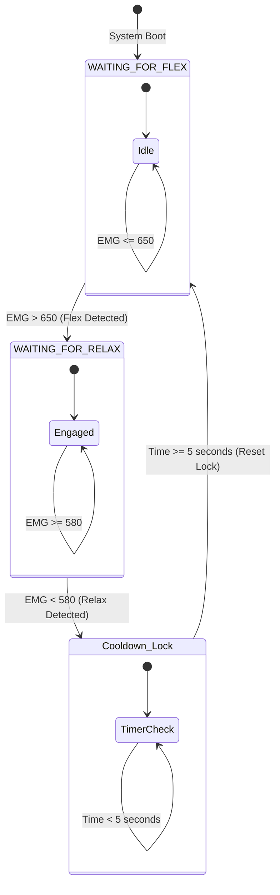

# Threshold Calibration & State Machine

To translate the continuous, noisy analog readings into a single, binary trigger (toggling play/pause), the firmware implements an empirical thresholding approach combined with a dual-state machine and hysteresis.

---

## 1. EMG Threshold Hysteresis Calibration

Relying on a single threshold to detect a muscle contraction is highly susceptible to noise. If the signal hovers around a single threshold, transient noise will trigger multiple rapid play/pause events, causing a "chattering" effect.

To prevent this, the system implements a **hysteresis band** defined by two separate thresholds:

1. **Flex Threshold ($T_{flex} = 650$)**: The signal must cross above this value to indicate the start of an intentional contraction.
2. **Relax Threshold ($T_{relax} = 580$)**: The signal must drop back below this value to confirm that the muscle has relaxed.

This creates a hysteresis margin of $70$ ADC units ($\approx 0.34\text{ V}$). Noise spikes within this range will not trigger state changes.

```text
  ADC Value
    1023 |
         |          /\
     650 |........./..\................... Flex Threshold (T_flex)
         |        /    \
     580 |......./......\.................. Relax Threshold (T_relax)
         |      /        \      /\
       0 +-----+----------+----+--+-----> Time
            [Flex]      [Relax]
              |            |
         Starts Event   Triggers Play/Pause
```

---

## 2. State-Machine Architecture

The contraction validation logic is modeled as a state machine with two primary states:

- **`WAITING_FOR_FLEX`**: The system is idling and scanning the analog input for a muscle spike.
- **`WAITING_FOR_RELAX`**: A spike has been detected. The system holds and waits for the user to relax their forearm muscle to complete the trigger.

The state transitions are outlined in the Mermaid diagram below:



---

## 3. Cooldown Timer Mechanics (Non-Blocking)

Once a complete *Flex $\rightarrow$ Relax* cycle is detected and a command is dispatched, the system enters a **cooldown lock period** (configured to $5\text{ seconds}$ or $5000\text{ ms}$). This lock prevents any rapid, repeated muscle twitches from triggering consecutive commands.

To maintain real-time responsiveness of other modules (such as updating the OLED display, reading serial commands, or scaling volume), this cooldown is implemented using a **non-blocking timer** based on the subtraction of CPU clock ticks (`millis()`), rather than freezing the thread:

```cpp
// Within updateEMG()
if (emgValue > flexThreshold && !flexDetected) {
  flexDetected = true;
}

if (emgValue < relaxThreshold && flexDetected) {
  unsigned long now = millis();
  
  // Non-blocking cooldown validation
  if (now - lastToggleTime > cooldownPeriod) {
    if (isPlaying) {
      dfplayer.pause();
      accumulatedTime += millis() - songStartTime;
      isPlaying = false;
    } else {
      dfplayer.start();
      songStartTime = millis();
      isPlaying = true;
    }
    lastToggleTime = now; // Reset cooldown marker
  }
  
  flexDetected = false; // Reset flex state regardless of cooldown
}
```

By placing the timer inside a subtraction check (`now - lastToggleTime > cooldownPeriod`), the CPU handles the comparison in a fraction of a microsecond and immediately proceeds to execute the rest of the loop, keeping the system responsive.
